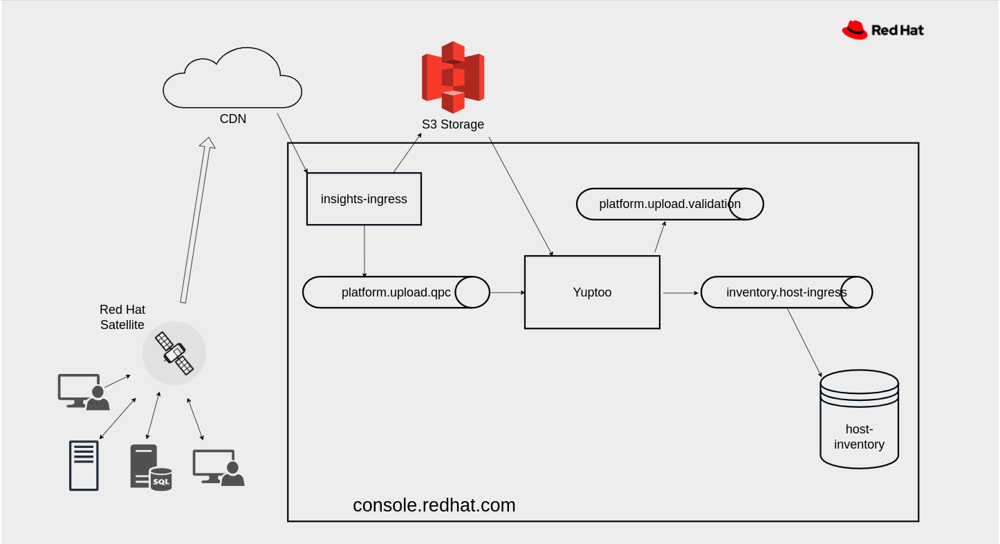

The Yuptoo service is responsible for processing bulk uploads of hosts.
A client(rh-cloud-plugin/satellite) will create a specially crafted tarball and send the file to the Insights Ingress service. The Ingress service will notify yuptoo via Kafka that a tarball has arrived for processing. Yuptoo downloads the tarball, performs top level validation, and sends the host JSON to the Insight's Host Inventory service.

https://github.com/RedHatInsights/yuptoo[Code Repository]

== Architecture Diagram

== How It Works
The following sequence diagram shows the data flow and processing of payload recevied on `platform.upload.qpc` kafka topic.

---

=== Dev Environment Setup

|===
|Environment |Document 

|Local
|https://github.com/RedHatInsights/yuptoo/blob/main/docs/local_environment.adoc[local_environment doc]

|Ephemeral Environment
|https://github.com/RedHatInsights/yuptoo/blob/main/docs/ephemeral_environment.adoc[ ephemeral_environment doc]
|===
